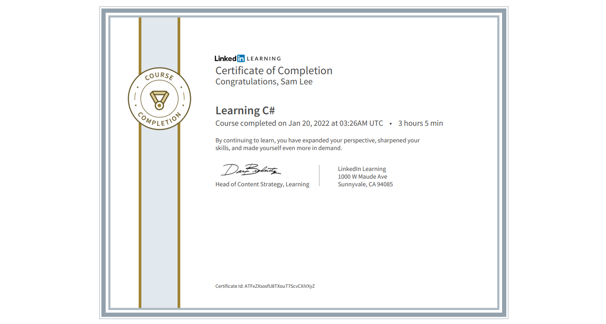

# Learning CSharp
> This repo contains source codes from the 'Learning C#' course in LinkedIn Learning.
> 
> Link: https://www.linkedin.com/learning-login/share?account=75841506&forceAccount=false&redirect=https%3A%2F%2Fwww.linkedin.com%2Flearning%2Flearning-c-sharp-8581491%3Ftrk%3Dshare_ent_url%26shareId%3D8gIYFQv%252BSSiXgdUV3o9jMw%253D%253D
> 
> Author: <strong><a href="https://www.linkedin.com/learning/instructors/joe-marini?trk=embed_lil">Joe Marini</a></strong>

# Certificate of Learning CSharp
>
> This is my second time going over this course.
> I will update my source code that has been covered in this course.
>
| Certificate              |
|---------------------|
|  |
